# Build a web API using Node, Express: Part 1

## Introduction

In this lab you will build a server-side simple web API using **Node.js** and **Express**. Node.js is a JavaScript runtime which can be used to execute JS in server-side applications. Express JS provides a framework which makes it easier
to build Node.js applications.

The API will return data as **JSON (JavaScript Object Notation)** and not complete web pages. It is up to the client side to present the data in an appropriate UI, etc.

Separating data from presentation means that the API can be shared by many different client applications including websites, mobile apps, smart devices, vehicles, etc.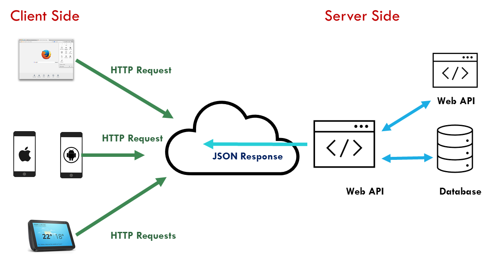

Future labs will build on this example, adding the database and other features.

## Prerequisites

Make sure that you have an up-to-date version of Node.js installed on your system. To check the current, open a console or terminal and run **node –v** You will see an error if Node.js is not currently installed.

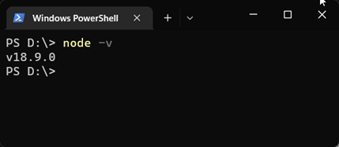

Then compare with the current version listed on the nodejs.org website. Download and update if required.

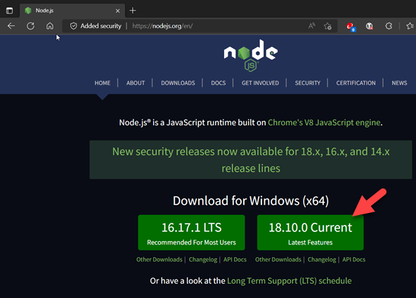

## Create a new application

The first step is to build a simple Node + Express API with minimal functionality. This will be our “Hello World” application.

Our application does not need the full range of Express features so we can create the application manually.

### Create an empty folder for the app

Add a new folder named **```api_start```** wherever you store your web apps.

### Open the folder in VS Code

It is important to **open the app folder in VS Code** and not individual files from a project.

Folders can be opened from the VS Code file menu or by right-clicking the folder in windows explorer and choosing **Open with VS Code**).

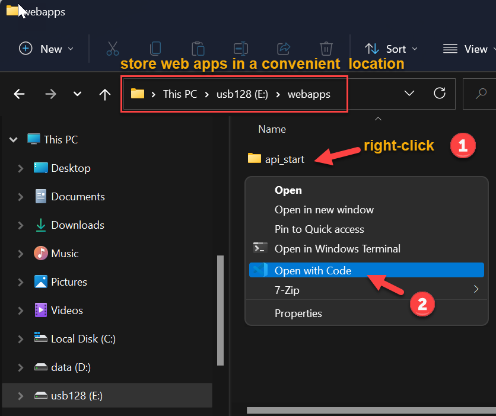

### Create a new Node.js application

1.  Open a **New Terminal** in VS Code

    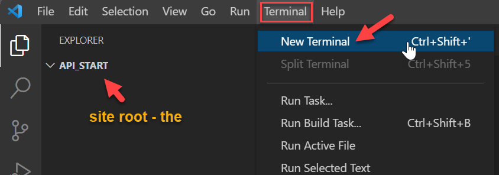
    
2.  At the terminal prompt, enter the command **```npm init```**

    You will be asked to enter some settings for the new project**, press enter to accept the defaults displayed**, **except for entry point**. Change this to **```app.js```** (we will use index.js for something else later).
    
    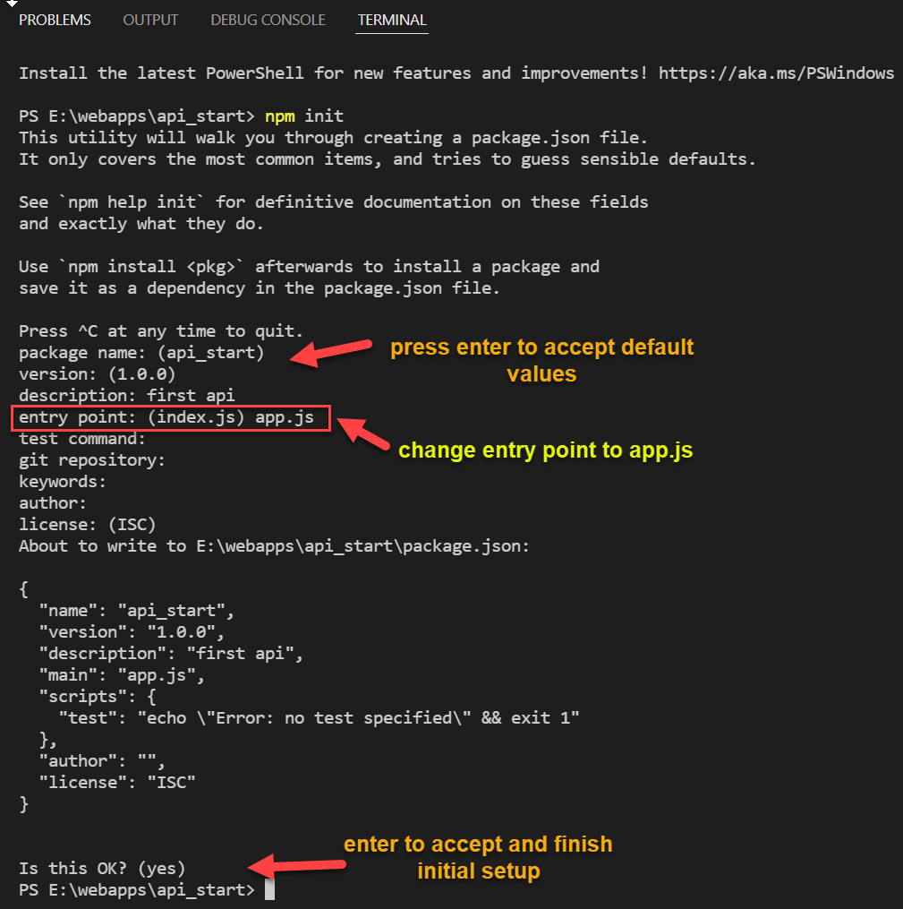

1.  You should see that **```npm init```** added a file, **package.json**, which is
    used to record application details, configuration, and dependencies

    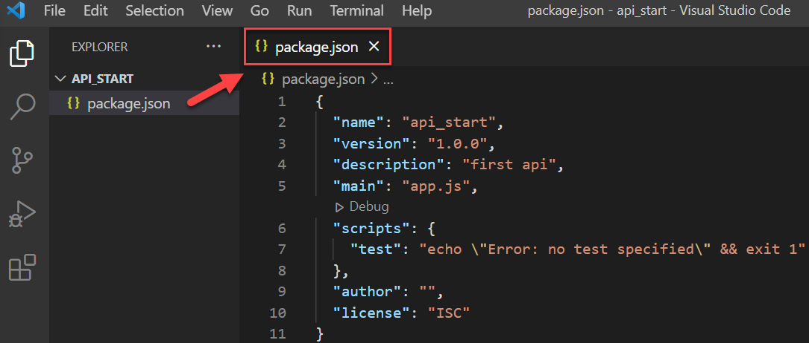
    
2.  Next install application dependencies using NPM, the **Node Package
    Manager**. For now, only **express** is required. To search NPM packages by
    name see the NPM repository <https://www.npmjs.com/>

    Use the **```npm install express```** command in the terminal to install **express**. You
    should see output like this, showing details about the installation,
    including any sub-dependencies:

    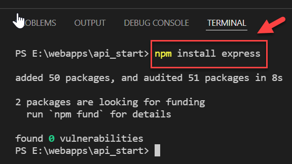
    
    The package is be added to the dependencies section in **package.json** .
    This allows the application to be easily deployed or re-created by issuing the **```npm install```** command
    
    

## Add functionality to build a simple web API

Make the web app do something useful –handle an HTTP request and return some
JSON data. Remember that we are building an API which will return data. It will
be up to the client-side to display the data.

1.  Add the following files and folders to the project root:

-   A file named **app.js**

-   folder named **controllers**

    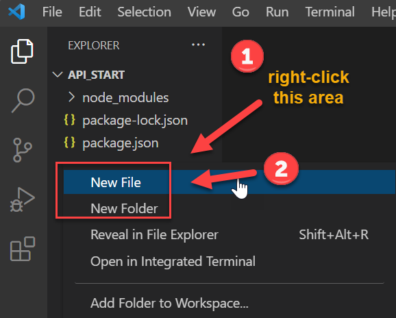
    

Add a file named **index.js** to the **controllers** folder.
    
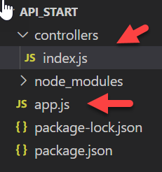

1.  **app.js** will be the Node application starting point where the application is defined and initialised. *Read code comments carefully for details*
    
    ```javascript
    // app.js is the application entry point
    // used by Node.js to define and start the application
    
    // Load dependencies
    const express = require('express');
    
    // Define an instance of Express (app)
    const app = express();
    
    // Defile the server host IP and port
    // This computer is localhost = 127.0.0.1
    const HOST = '127.0.0.1';
    
    // if port defined and an environment var, use that value, otherwise 5000
    const PORT = process.env.PORT || 5000;
    
    // Application settings
    app.use((req, res, next) => {
    
        // Globally set Content-Type header for the application
        res.setHeader("Content-Type", "application/json");
        next();
    }); 
    
    // Allow app to support differnt body content types
    app.use(express.text());
    // support json encoded bodies
    app.use(express.json());
    // support url encoded bodies
    app.use(express.urlencoded({ extended: true }));
    
    // Routes - Configure app Routes to handle requests from browser
    // These will be redirected to a controller
    app.use('/', require('./controllers/index'));
    
    // Globally catch 404 and forward to error handler
    app.use((req, res, next) => {
        var err = new Error('Not Found: '+ req.method + ":" + req.originalUrl);
        err.status = 404;
        next(err);
    });
    
    // Start the HTTP server and listen for requests
    app.listen(PORT, HOST, () => {
        console.log(`Express server listening at http://${HOST}:${PORT}`);
      });
    ```

    

2.  Edit **index.js** in the **controllers** folder. App.js will load this page when <http://localhost:5000/> is requested.
    
    This **endpoint** needs to handle the **HTTP GET request** and send a response when called.
    
    a. **```router.get('/', (req, res) ```** defines how a response will be generated when a request for **```/```** is received. 
    **req** and **res** represent the request and response.
    
    b. The code  contained in the **```{ }```** after  **```=>```** 		defines the function body, which will handle the request and send the		response.
    
    Here’s the full code for **/controllers/index.js**. Read the comments for details.
    
    ```javascript
    // This is the index controller
    // It defines an endpoint for the default route
    
    // Import router package
    const router = require('express').Router();
    
    /*
    /* Handle get requests for '/'
    /* this is the default or 'index' route
    /* req and res represent the incoming request and outgoing response
    */
    router.get('/', (req, res) => {
    
        // set content type of response body in the headers
        // As this is defined globally in app.js it can be ommitted from here
        res.setHeader('Content-Type', 'application/json');
    
        // Send a  response - this app will be a web api so no need to send HTML
        res.json({message: 'Hello World!'});
    
    });
    
    // export the router function so that it can be imported elsewhere
    module.exports = router;
    
    ```
    
    
    
1.  **Running the application**

    First, make sure all dependencies have been installed by running **```npm install```** in the terminal.
    
    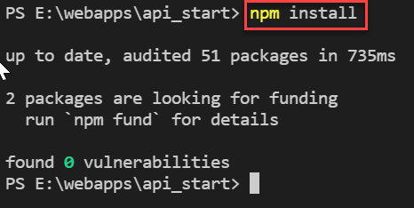
    
    The **```node_modules```** folder will be added to the application or updated.

    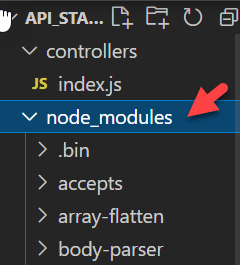

    In order to run the application using **```npm```**, first add a new **start script** to the scripts section of **```package.json```**
    
    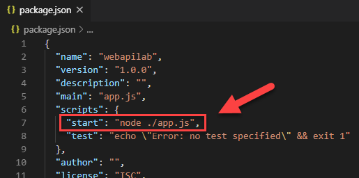
    
    Save the changes, then in the terminal, use the command **```npm run start```** to start the application using the script just added, which uses Node.js to
    execute **```app.js```**
    
    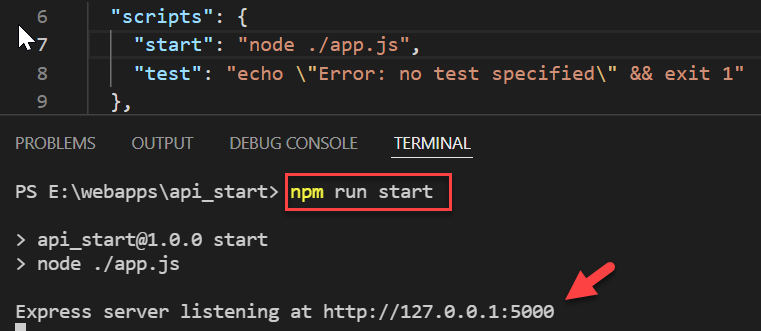
    
2.  **Now try it in a web browser:**

    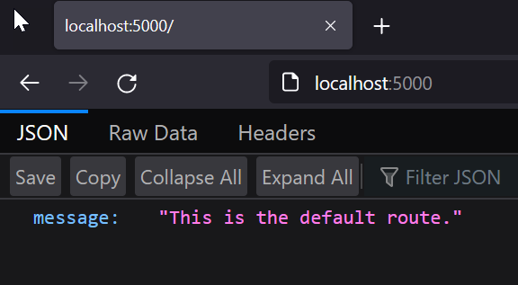
    

Notice that the response was sent as **JSON**, which is what we need from the web API.

## Auto restarting after saving files in developer mode

You may notice that after making changes to source files, the server must be manually stopped **```ctrl-c```** and then restarted **```npm run start```** for changes
to take effect. This is annoying! Test by editing **```index.js```** and saving.

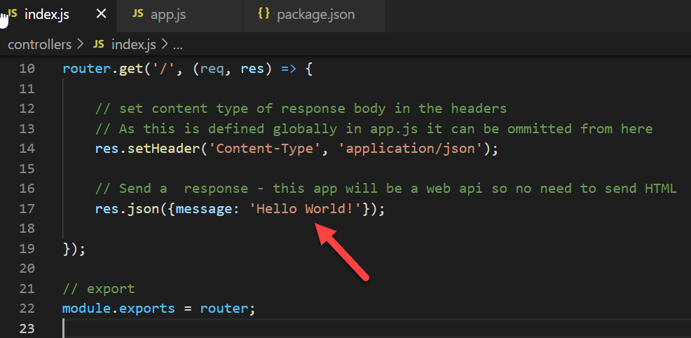

Then reload the page in the browser, without restarting the app. A solution to this is to use a package, **```nodemon```**, to auto restart whenever a
file is saved. Install it for developer mode only:

**```npm install nodemon --save-dev```**

Then add a dev start script to **package.json**:

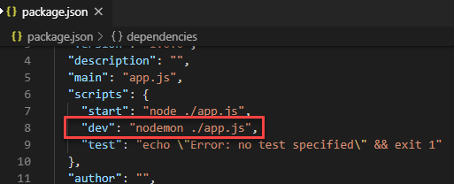

Now start the app using **```npm run dev```** and try changing **index.js** and then reloading the web page.

------

Enda Lee 2022
